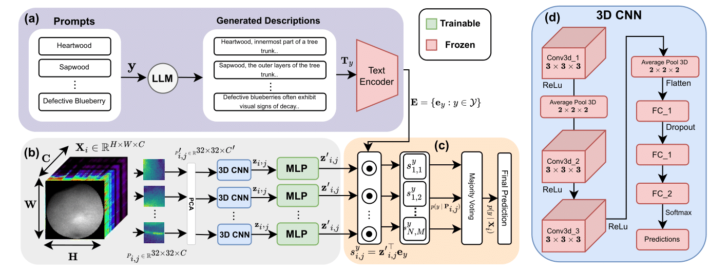

# Label Semantics for Robust Hyperspectral Image Classification

This repository contains code and resources from our IJCNN 2025 paper **"Label Semantics for Robust Hyperspectral Image Classification"**, with detailed implementation for the **Hyperspectral Blueberry** dataset using 3D-CNN and the proposed **S3FN** (Semantics-Supervised Spectral Feature Network) framework.

---

## Overview

We propose a novel architecture (**S3FN**) that leverages label semantics to guide hyperspectral image classification. The pipeline integrates hyperspectral cube processing, dimensionality reduction, 3D-CNN training, and semantic embedding using large language models.

---

## Repository Structure (Simplified for Blueberry Dataset)

```bash
HyperspectralBlueberries/
├── 3DCNN.ipynb                   # 3D CNN pretraining
├── Baseline_SM.ipynb            # Baseline training with spectral means
├── S3FN.ipynb                   # S3FN training and evaluation
├── Test_w_voting.ipynb          # Final evaluation with voting
├── dataset_preprocessing/
│   ├── Individual_spectral_means.ipynb
│   ├── merge_SM_npy.ipynb
│   ├── dataset_split.ipynb
│   ├── individual_cube_extraction.ipynb
│   ├── combine_cubes_npy.ipynb
│   ├── random_cube.ipynb
│   └── PCA.ipynb
├── embedding/
│   ├── GPT_prompt.ipynb
│   └── label_embeddings_roberta_bert.ipynb
└── extract_3DCNN_features.ipynb
```

---

## S3FN Architecture

 <sub>*Figure: Overall pipeline for S3FN. Stage 1: Feature extraction; Stage 2: Semantic fusion and classification.*</sub>

---

## How to Run (Blueberry Dataset)

### Baseline Pipeline

1. **Extract Spectral Means**

   ```bash
   Run: dataset_preprocessing/Individual_spectral_means.ipynb
   ```

2. **Combine & Split Data**

   ```bash
   Run: dataset_preprocessing/merge_SM_npy.ipynb
   Run: dataset_preprocessing/dataset_split.ipynb
   ```

3. **Train Baseline Model**

   ```bash
   Run: Baseline_SM.ipynb
   ```

---

### S3FN Pipeline

#### Stage 1: Cube Preprocessing, PCA & 3D CNN Training

1. **Extract Individual Cubes**

   ```bash
   Run: dataset_preprocessing/individual_cube_extraction.ipynb
   ```

2. **Combine Cubes & Generate 32×32×C Random Cubes**

   ```bash
   Run: dataset_preprocessing/combine_cubes_npy.ipynb  
   Run: dataset_preprocessing/random_cube.ipynb
   ```

3. **Dimensionality Reduction**

   ```bash
   Run: dataset_preprocessing/PCA.ipynb
   ```

4. **Pretrain 3D CNN**

   ```bash
   Run: 3DCNN.ipynb
   ```

#### Stage 2: Semantic Embedding + Fusion

5. **Generate Label Descriptions (LLM)**

   ```bash
   Run: embedding/GPT_prompt.ipynb
   ```

6. **Embed Descriptions with Roberta/BERT**

   ```bash
   Run: embedding/label_embeddings_roberta_bert.ipynb
   ```

7. **Extract CNN Features**

   ```bash
   Run: extract_3DCNN_features.ipynb
   ```

8. **Train & Evaluate S3FN**

   ```bash
   Run: S3FN.ipynb  
   Run: Test_w_voting.ipynb
   ```

---

## Dependencies

Install Python dependencies with:

```bash
pip install -r requirements.txt
```

---

## Citation

If you find this work useful, please cite our paper:

```bibtex
@inproceedings{your_citation_key_2025,
  title={Label Semantics for Robust Hyperspectral Image Classification},
  author={Your Name and Coauthors},
  booktitle={International Joint Conference on Neural Networks (IJCNN)},
  year={2025}
}
```

---

## License

This project is licensed under the terms of the [MIT License](LICENSE).
